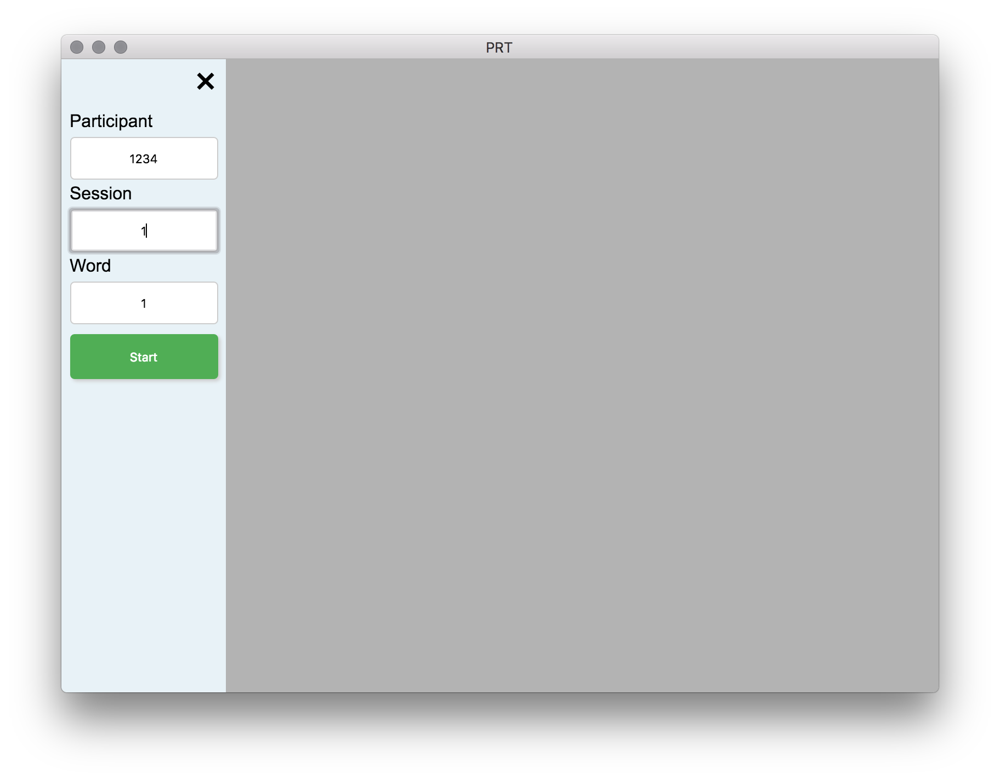
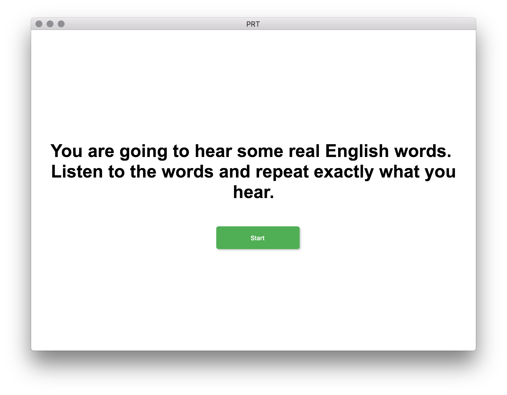

# PRT

(Philadelphia Repetition Test)

##### Dowload the [latest version](https://github.com/hanayik/Philadelphia-Repetition-Test/releases/latest)

### Description
The Philadelphia Repetition Test uses the same 175 stimuli as the [Philadelphia Naming Test](http://mrri.org/philadelphia-naming-test/) except rather than participants naming pictures, they hear a pre-recorded audio file (a spoken word, no pictures shown) and attempt to repeat exactly what they hear (Dell, Martin, & Schwartz, 2007).

The saved video location will depend on your computer. The program automatically detects if you have Dropbox, or Box folders on your computer and tries to save to those locations first, in that order. If you do not wish to save to the cloud folders then uncheck that option in the menu bar. If the cloud saving option is unchecked, or those folders do not exist on your computer then the app will save to it's default MacOS location which is ``` ~/Library/Application Support/PRT/data ```


  

### Screenshots





### Credits
[Icon](http://www.flaticon.com/authors/madebyoliver)

[ffmpeg](https://www.ffmpeg.org/)

### License
[MIT](https://github.com/hanayik/Philadelphia-Repetition-Test/blob/master/LICENSE)

This app was made specifically for the CSTAR group, but is open source so that others may modify and use as desired.

### Developers
This app is currently only developed for MacOS, and a compiled version of ffmpeg is bundled with the app. 

##### To clone repo:

``` cd /to/your/desired/install/location ```

``` git clone https://github.com/hanayik/Philadelphia-Repetition-Test.git ```

##### To install packages:

``` cd Philadelphia-Repetition-Test ```

``` npm install ```

##### To run

``` npm start ```


### Links
[CSTAR](https://cstar.sc.edu/)

[Aphasia Lab](https://web.asph.sc.edu/aphasia/)


